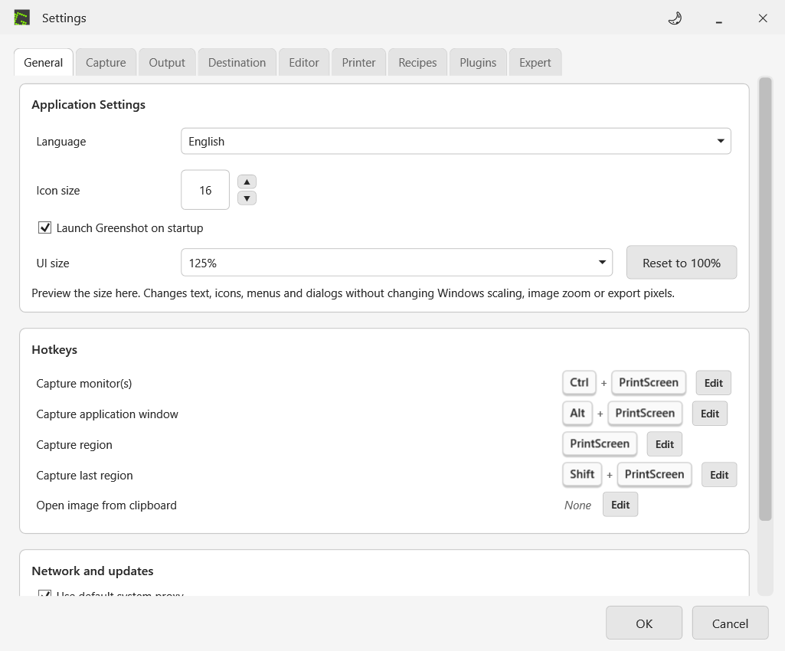
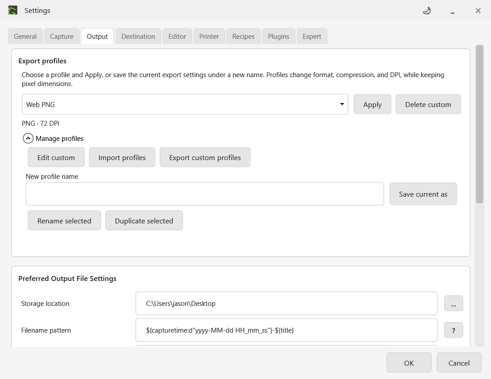
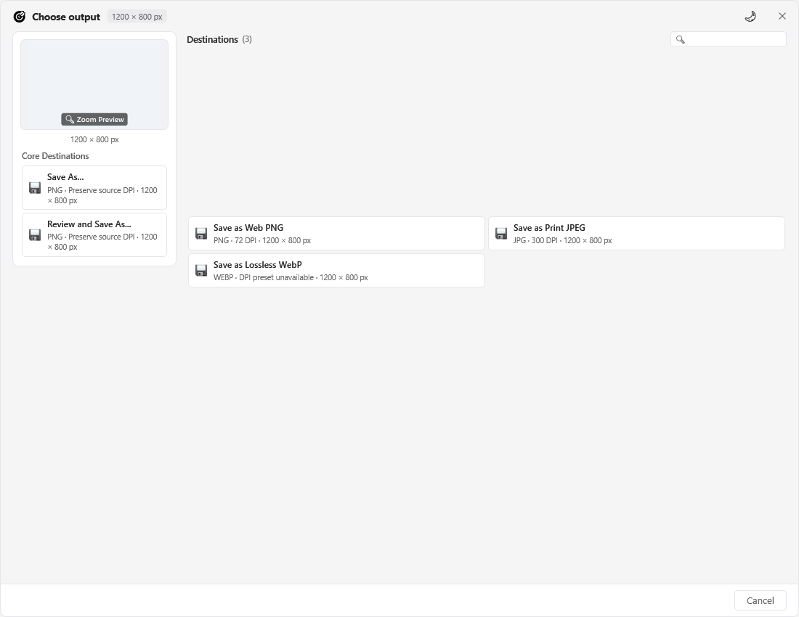
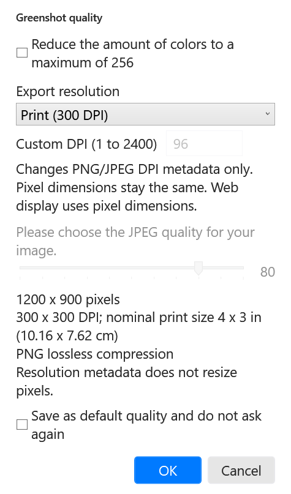
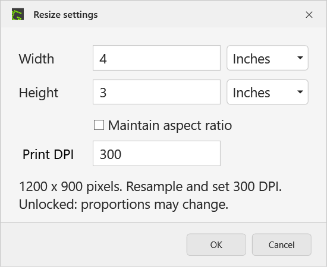
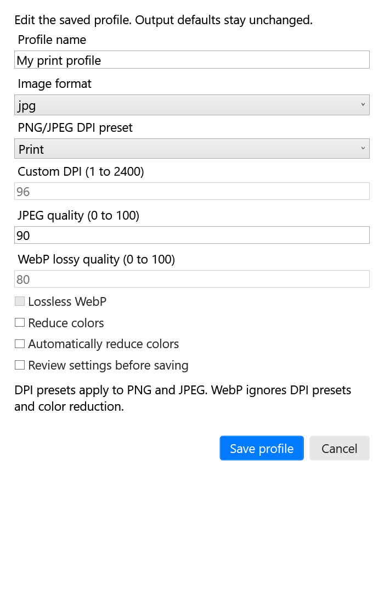
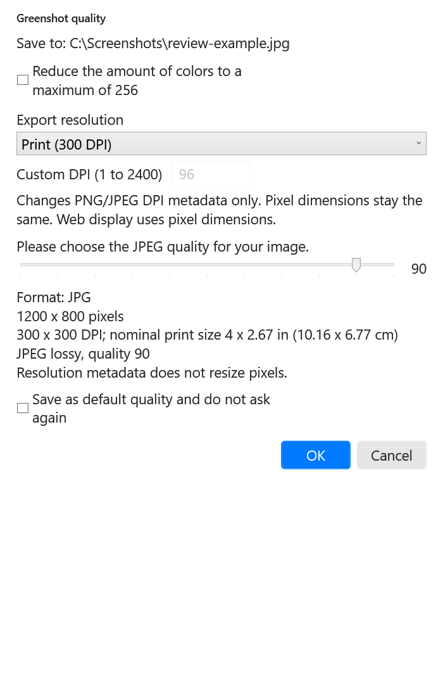

# Greenshot settings guide

These images render the actual development build controls offscreen at 125% UI size. They are not native desktop captures. Native mouse/keyboard and Save As acceptance remains pending.

## UI size

Open **Preferences > General > UI size**. Choose 100%, 125%, 150%, or 200%. Use **Reset to 100%** to restore the default. This changes application controls separately from Windows scaling and image zoom.

The hotkey labels distinguish monitor captures from application-window captures. On multiple displays the tray menu offers all monitors, the monitor at the pointer, or a listed monitor.

## Output format and export profiles

Open **Preferences > Output**. Select WebP in **Image format (PNG, JPEG, WebP...)**; the compression controls are further down in Quality settings. Save As can choose a format for one file.

Choose Web PNG, Print JPEG, or Lossless WebP in **Export profiles**, then press **Apply**. Merely selecting a profile does not apply it. Web PNG uses 72 DPI metadata; Print JPEG uses 300 DPI metadata and quality 90; Lossless WebP uses exact compression. Profiles do not resize pixels.

Enter a unique **New profile name** and press **Save current as** to retain the current export preferences. Up to 20 custom profiles are supported. **Delete custom** removes a saved custom profile without changing the current export settings. Profiles do not store paths, overwrite policy, or filename patterns. Preferences uses live bindings, so Cancel is not a full rollback of valid edits.

This example selects Web PNG without pressing Apply, so the active DPI remains Preserve. Quality controls continue below the scroll position.

## Export resolution and summary

The capture destination picker offers **Save as Web PNG**, **Save as Print JPEG**, **Save as Lossless WebP**, and saved custom profiles. Each choice applies to that save only; output defaults stay unchanged. Save As preselects the profile format, and you can choose another format there. The profile's DPI applies only when the final format is PNG or JPEG. Fixed export policies hide profile choices.

A custom profile may enable the quality prompt. Its existing the remember-defaults checkbox is an explicit choice to update defaults; leave it unchecked for a temporary export.

Save As shows the current default format, DPI preset, and image pixels in the capture picker and editor File menu. Preserve is labeled **Preserve source DPI**. The selected file format and optional quality prompt determine the final export.

This is an offscreen render of the application's capture picker at its default UI size, not a native desktop capture.

## Launching again

Launching the same preview again opens the running instance's Preferences. The isolated launcher forwards the existing settings command without rewriting settings or logs. If a different Greenshot is running, save your work and normally Exit it before starting this package.

Enable the quality prompt under **Preferences > Output**. When saving PNG or JPEG, choose Preserve, Web 72, Print 300, or Custom DPI. The summary shows pixels, selected resolution, nominal print dimensions, and compression. Resolution metadata alone does not resize pixels.

The example is 1200 by 900 pixels at 300 DPI, nominally 4 by 3 inches. JPEG quality is disabled because this example saves PNG. WebP is available under **Preferences > Output > Image format** and in **Save As**; its compression controls are separate and DPI presets do not apply.

## Inches and centimeters

Open the editor **Resize** dialog. Select Inches or Centimeters for dimensions and enter Print DPI from 1 to 2400. This explicitly resamples the image. Keep aspect ratio to derive the other dimension, or unlock it to specify both dimensions, which may change proportions.

Enlarging requires **Allow upscaling** acknowledgment and adds no detail. Cancel leaves the resize effect unchanged. Later PNG/JPEG export presets can override the resized image DPI.

The [published whitepaper](https://cardonalab.dev/static/greenshot-export/index.html#settings-screenshots) includes these figures and downloadable full-size images.

## Manage saved profiles

Open **Preferences > Output > Manage profiles**. The selected profile summary shows format, DPI, and compression. Enter a **New profile name** before **Duplicate selected** or **Rename selected**. Built-ins can be duplicated, but cannot be renamed, edited, or deleted.

**Edit custom** opens a separate draft containing the name, format, DPI, quality, color reduction, and review preference. **Save profile** changes the saved profile; **Cancel** leaves it unchanged. Output defaults only change when you press **Apply**.

**Export custom profiles** writes a portable XML file. **Import profiles** adds its custom profiles as one transaction. Duplicate or reserved names, invalid values, oversized files, and more than 20 combined custom profiles reject the entire import. Existing saved profiles remain intact. Rename a conflicting profile before importing. Import/export does not include paths, hotkeys, capture settings, or overwrite policy.

## Review one save

Choose **Review and Save As...** in the capture picker or editor File menu. Pick the filename and final format first. The review dialog then shows that destination, the final format, rendered pixels, supported DPI, nominal print size, and compression before writing. It works even when the default quality prompt is off. Cancelling either dialog preserves an existing destination file.

PNG/JPEG support DPI presets. WebP and other formats explicitly say the DPI presets do not apply. Changing the final Save As format takes priority over the profile's preferred format. Leave the remember-defaults checkbox unchecked to keep the review temporary; that checkbox explicitly remembers supported defaults.

## Stable launcher and preferences

After extracting a fresh release, run its **Install-Preview.ps1** with **PackageDirectory** and **LauncherDirectory** pointing to the stable folder you want to use. For the first upgrade, **PreviousPackageDirectory** can point to the old preview folder. The installer verifies package hashes before updating the pointer, keeps the previous pointer, and creates **Start-Greenshot.cmd** beside **Start-Greenshot.ps1**.

Use the same **Start-Greenshot.cmd** for future versions. Normally Exit an older running preview first. On the first stable launch, the old preview's saved settings are copied into **state/settings/greenshot.ini**, with a backup. Later versions reuse that file without overwriting it. Logs live in **state/logs**. Installed Greenshot preferences remain separate. The launcher does not stop a process or add Windows startup entries.

Run **Get-PreviewDiagnostics.ps1** to print a small local JSON report, or pass **OutputPath** to save it. It reports the selected source/version, process presence and response, and whether shared settings/log folders exist. It excludes log contents, preference contents, screenshots, and window titles. It does not upload anything.

The stable launcher honors the existing PowerShell execution policy. Package hashes are checked before launch; the app's logging configuration is generated at launch and is a mutable runtime file.
